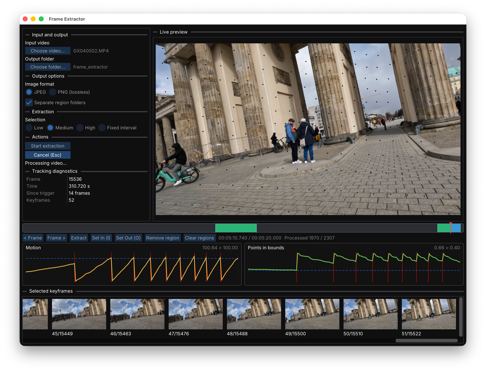

# Frame Extractor

**Adaptive video frame extraction for Structure from Motion, Gaussian Splatting,
photogrammetry, and related 3D reconstruction workflows.**

Frame Extractor turns video into image sequences for reconstruction pipelines
such as COLMAP and Gaussian Splatting.

Unlike conventional fixed-interval extraction, it can select keyframes
dynamically based on camera motion. This reduces redundant images when the
camera is stationary or moving slowly, while extracting frames more frequently
during fast movement or rotation.

The result is a smaller, more useful image set with better overlap between
neighboring views.



## Why adaptive extraction?

A typical video-to-SfM workflow extracts every *N*th frame:

```text
Video → every 10th frame → images → SfM / Gaussian Splatting
```

The problem is that camera motion is rarely constant.

When the camera stops or moves slowly, fixed sampling creates many nearly
identical images. When it moves or rotates quickly, the same interval may leave
too much change between frames, making feature matching and pose recovery
harder.

Frame Extractor adapts the spacing automatically:

```text
Slow motion:   ●             ●             ●
Fast motion:   ●   ●   ●   ●   ●   ●   ●   ●
```

## Features

- **Motion-adaptive keyframe extraction** with Low, Medium, and High presets
- **Fixed-interval extraction** when exact sampling is preferred
- **Multiple timeline regions** to extract only useful sections of a video
- **Manual frame extraction** from the preview
- **JPEG or lossless PNG** output at source resolution
- Frame-accurate navigation and live preview
- Optional separate output folders for each selected region
- CSV manifest, extraction settings, and summary saved alongside the images
- Desktop GUI and command-line interface
- All processing runs locally

Frame Extractor is written in **C++20** and is designed to be fast and easy to
use without requiring Python or command-line setup.

## Download

The current test release is **v0.2.0-rc.2**:

- **macOS Apple Silicon** — [DMG](https://github.com/morishuz/adaptive-frame-extractor/releases/download/v0.2.0-rc.2/Frame-Extractor-0.2.0-macOS-arm64.dmg) · [SHA-256](https://github.com/morishuz/adaptive-frame-extractor/releases/download/v0.2.0-rc.2/Frame-Extractor-0.2.0-macOS-arm64.dmg.sha256)
- **Windows x64** — [ZIP](https://github.com/morishuz/adaptive-frame-extractor/releases/download/v0.2.0-rc.2/frame-extractor-0.2.0-win64.zip) · [SHA-256](https://github.com/morishuz/adaptive-frame-extractor/releases/download/v0.2.0-rc.2/frame-extractor-0.2.0-win64.zip.sha256)
- **Ubuntu 24.04 x64** — [tar.gz](https://github.com/morishuz/adaptive-frame-extractor/releases/download/v0.2.0-rc.2/frame-extractor-0.2.0-Linux-x86_64.tar.gz) · [SHA-256](https://github.com/morishuz/adaptive-frame-extractor/releases/download/v0.2.0-rc.2/frame-extractor-0.2.0-Linux-x86_64.tar.gz.sha256)

See [GitHub Releases](https://github.com/morishuz/adaptive-frame-extractor/releases)
for all available versions.

These builds are not yet production-signed releases. On macOS, you may need to
right-click the application and select **Open** the first time.

macOS is currently the primary tested platform. Windows and Linux builds are
also covered by automated tests.

## Using Frame Extractor

1. Drag a video into the application.
2. Choose an output directory.
3. Select an adaptive preset or fixed interval.
4. Optionally mark one or more regions on the timeline.
5. Choose JPEG or PNG.
6. Click **Start extraction**.

For adaptive extraction, **Low**, **Medium**, and **High** control how densely
keyframes are selected.

You can also navigate frame-by-frame and use **Extract** to save individual
frames manually.

Manual captures are saved under `manual_frames/<video-name>-<source-id>/`.
Filenames use the original presentation timestamp (`frame_pts_<timestamp>`) to
distinguish variable-frame-rate frames; videos without timestamps use frame
numbers. Repeating a capture reuses its existing file. Older captures with
frame-number filenames remain in place and may be saved again under the new name.

## Output

Each run creates a timestamped directory containing the extracted images and
metadata:

```text
20260827_120000/
  config.yaml
  keyframes.csv
  summary.txt
  keyframes/
    keyframe_0000_000000.jpg
    keyframe_0001_000037.jpg
    ...
```

## Command-line interface

A CLI is included for scripted workflows:

```sh
./build/release/frame-extractor input.mp4 --output-dir output
```

Run the following for all available options:

```sh
./build/release/frame-extractor --help
```

## Building from source

Frame Extractor uses C++20, CMake, FFmpeg, OpenCV, SDL3, Dear ImGui, yaml-cpp,
and Catch2.

See the [development guide](docs/development.md) for complete build instructions
for macOS, Windows, and Ubuntu Linux. Maintainer packaging and release details
are in the [release guide](docs/releasing.md).

## Current limitations

- Blur/sharpness-aware automatic selection is not yet implemented.
- macOS packages currently target Apple Silicon.
- Windows and Linux have received less hands-on testing than macOS.

## License

Frame Extractor is released under the [MIT License](LICENSE). Distributed
packages also contain third-party software covered by the
[third-party notices](THIRD_PARTY_NOTICES.md).

Bug reports and contributions are welcome. See
[CONTRIBUTING.md](CONTRIBUTING.md). Please report suspected security
vulnerabilities privately as described in [SECURITY.md](SECURITY.md).
